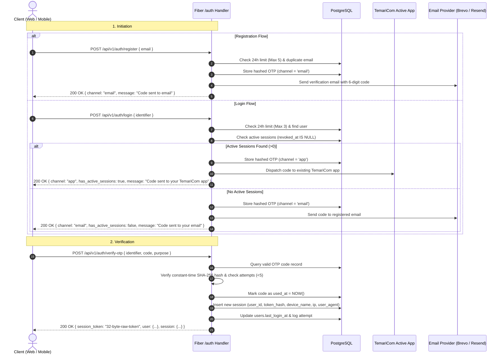

# TemariCom Authentication System Design (`auth-design.md`)

> **Architecture & Implementation Specification**  
> **Backend Reference:** `backend/internal/auth` (Go + Fiber + PostgreSQL `pgxpool`)  
> **Database Reference:** `migrations/001_auth_module_tables.up.sql`  
> **Client Parity:** Web (`web/src/features/auth`) & Mobile (`mobile/src/features/auth`)  
> **Status:** Simplified & Aligned with TemariCom Backend

---

## 1. Overview & Core Philosophy

TemariCom uses a **Telegram-inspired, passwordless, OTP-first authentication system**.

### Key System Rules:

1. **Unrestricted Guest Browsing:** Guests can freely view the feed, search announcements, browse opportunities, and view lost items without logging in.
2. **Action Interception:** Protected actions (liking a post, commenting, chatting, bookmarking, creating posts) pop up the Auth Modal in-place. The user's intended action executes immediately after authentication completes without a page reload or losing scroll position.
3. **No Passwords on Sign Up:** Accounts are authenticated using a 6-digit one-time verification code (OTP).
4. **Smart Dual-Channel OTP Routing:**
   - **Active Session Found in DB:** If the user has an active session on another device (`revoked_at IS NULL`), the OTP is sent **directly to TemariCom App** (in-app notification).
   - **No Active Sessions / Revoked:** If the user has no active sessions, the OTP is sent to their **Email**.
5. **Multi-Device Support:** A user can have multiple concurrent active sessions (e.g., Android phone, Windows PC, Web browser).
6. **Multi-Account Switching on One Device:** Like Telegram, a single device/browser can store and switch between multiple accounts without logging out.
7. **Profile Separation:** Profile management is decoupled into the Profile module; the Auth module strictly handles identity verification, credentials, sessions, and switching.

---

## 2. Core API Endpoints

All endpoints are grouped under `/api/v1/auth`.

| Method | Endpoint                  | Request Body           | Description                                                  |
| :----- | :------------------------ | :--------------------- | :----------------------------------------------------------- |
| `POST` | `/api/v1/auth/register`   | `dto.RegisterRequest`  | Requests registration OTP for a new email                    |
| `POST` | `/api/v1/auth/login`      | `dto.LoginRequest`     | Requests login OTP for an existing email/phone               |
| `POST` | `/api/v1/auth/verify-otp` | `dto.VerifyOTPRequest` | Verifies 6-digit OTP, creates session, returns session token |
| `GET`  | `/api/v1/auth/me`         | _None (Bearer Token)_  | Validates active session token and returns user details      |
| `POST` | `/api/v1/auth/logout`     | _None (Bearer Token)_  | Revokes the current session in PostgreSQL                    |
| `GET`  | `/api/v1/auth/health`     | _None_                 | Health check (`{"module":"auth","status":"ok"}`)             |

---

## 3. Strict Rate Limiting & Abuse Prevention

The backend enforces strict limits at both the application service layer and HTTP middleware layer:

| Scope                   | Limit              | Window                                   | Error Returned                                                  |
| :---------------------- | :----------------- | :--------------------------------------- | :-------------------------------------------------------------- |
| **Registration OTP**    | **Max 5 requests** | **24 hours** (`MaxDailyRegistrationOTP`) | `429 Too Many Requests`: `ErrDailyRegistrationLimitExceeded`    |
| **Login OTP**           | **Max 3 requests** | **24 hours** (`MaxDailyLoginOTP`)        | `429 Too Many Requests`: `ErrDailyLoginLimitExceeded`           |
| **Failed OTP Attempts** | **Max 5 attempts** | Per Code (`MaxOTPAttempts`)              | `401 Unauthorized`: `ErrMaxAttemptsExceeded` (Code invalidated) |
| **OTP Code Expiry**     | **5 minutes**      | `OTPExpiryDuration`                      | `410 Gone`: `ErrExpiredOTP`                                     |
| **HTTP Route Limiter**  | **5 requests**     | **1 minute** per IP                      | `429 Too Many Requests` (`AuthRateLimiter`)                     |

---

## 4. Request & Response DTOs

### 4.1 Registration Request & Response

```go
// POST /api/v1/auth/register
type RegisterRequest struct {
    Email string `json:"email" validate:"required,email"`
}

type SendOTPResponse struct {
    Identifier        string `json:"identifier"`
    Purpose           string `json:"purpose"`           // "registration" | "login" | "recovery"
    Channel           string `json:"channel"`           // "app" | "email"
    HasActiveSessions bool   `json:"has_active_sessions"`
    ExpiresIn         int64  `json:"expires_in"`        // Expiry in seconds (300)
    Message           string `json:"message"`
}
```

### 4.2 Login Request

```go
// POST /api/v1/auth/login
type LoginRequest struct {
    Identifier string `json:"identifier" validate:"required"` // Email or Phone
}
```

### 4.3 Verify OTP Request & Session Response

```go
// POST /api/v1/auth/verify-otp
type VerifyOTPRequest struct {
    Identifier string  `json:"identifier" validate:"required"`
    Code       string  `json:"code" validate:"required,len=6"`
    Purpose    string  `json:"purpose" validate:"required,oneof=registration login recovery"`
    Email      *string `json:"email,omitempty"`
}

type AuthSessionResponse struct {
    SessionToken    string          `json:"session_token"` // 32-byte cryptographically secure token
    RequiresTwoStep bool            `json:"requires_two_step"`
    User            UserResponse    `json:"user"`
    Session         SessionResponse `json:"session"`
}

type SessionResponse struct {
    ID         uuid.UUID `json:"id"`
    DeviceName *string   `json:"device_name,omitempty"`
    DeviceType *string   `json:"device_type,omitempty"`
    IPAddress  *string   `json:"ip_address,omitempty"`
    UserAgent  *string   `json:"user_agent,omitempty"`
    LastUsedAt time.Time `json:"last_used_at"`
    CreatedAt  time.Time `json:"created_at"`
    IsCurrent  bool      `json:"is_current"`
}
```

---

## 5. PostgreSQL Database Schema (`001_auth_module_tables.up.sql`)

The database uses PostgreSQL with the `pgcrypto` extension for UUID generation.

### 5.1 `users` Table

```sql
CREATE TABLE users (
    id UUID PRIMARY KEY DEFAULT gen_random_uuid(),
    email VARCHAR(255) UNIQUE,
    phone VARCHAR(20) UNIQUE,
    username VARCHAR(50) UNIQUE,
    password_hash TEXT,
    account_status VARCHAR(30) NOT NULL DEFAULT 'pending', -- 'pending','active','suspended','banned','deactivated'
     full_name  VARCHAR(100),
    avatar_url VARCHAR(500),
    bio        VARCHAR(255),
    is_verified BOOLEAN NOT NULL DEFAULT false,
    last_login_at TIMESTAMPTZ,
    last_login_ip INET,
    created_at TIMESTAMPTZ NOT NULL DEFAULT NOW(),
    updated_at TIMESTAMPTZ NOT NULL DEFAULT NOW(),
    CONSTRAINT check_email_or_phone CHECK (email IS NOT NULL OR phone IS NOT NULL)
);

CREATE INDEX idx_users_created_at ON users(created_at DESC);
```

### 5.2 `verification_codes` Table

Temporary OTP codes. The plaintext code is **never stored**; only a SHA-256 hash is saved.

```sql
CREATE TABLE verification_codes (
    id UUID PRIMARY KEY DEFAULT gen_random_uuid(),
    user_id UUID REFERENCES users(id) ON DELETE CASCADE,
    identifier VARCHAR(255) NOT NULL,
    code_hash TEXT NOT NULL,
    purpose VARCHAR(30) NOT NULL, -- 'registration', 'login', 'recovery'
    channel VARCHAR(20) NOT NULL DEFAULT 'email', -- 'app', 'email'
    attempts INT NOT NULL DEFAULT 0,
    expires_at TIMESTAMPTZ NOT NULL,
    used_at TIMESTAMPTZ,
    created_at TIMESTAMPTZ NOT NULL DEFAULT NOW(),
    CONSTRAINT check_verification_purpose CHECK (purpose IN ('registration', 'login', 'recovery')),
    CONSTRAINT check_verification_channel CHECK (channel IN ('app', 'email'))
);

CREATE INDEX idx_verification_codes_identifier_purpose_created
    ON verification_codes(identifier, purpose, created_at DESC);
```

### 5.3 `sessions` Table

Stores long-lived authenticated sessions for multi-device support. The raw token is **never stored**; only its SHA-256 hash (`token_hash`) is kept.

```sql
CREATE TABLE sessions (
    id UUID PRIMARY KEY DEFAULT gen_random_uuid(),
    user_id UUID NOT NULL REFERENCES users(id) ON DELETE CASCADE,
    token_hash TEXT NOT NULL UNIQUE,
    device_name VARCHAR(100),
    device_type VARCHAR(30),
    ip_address INET,
    user_agent TEXT,
    last_used_at TIMESTAMPTZ NOT NULL DEFAULT NOW(),
    created_at TIMESTAMPTZ NOT NULL DEFAULT NOW(),
    revoked_at TIMESTAMPTZ
);

CREATE INDEX idx_sessions_user_id ON sessions(user_id);
CREATE INDEX idx_sessions_user_id_active ON sessions(user_id) WHERE revoked_at IS NULL;
```

### 5.4 `login_requests` Table

Enables Telegram-style approval when logging into a new device from an existing session.

```sql
CREATE TABLE login_requests (
    id UUID PRIMARY KEY DEFAULT gen_random_uuid(),
    user_id UUID NOT NULL REFERENCES users(id) ON DELETE CASCADE,
    requesting_device_name VARCHAR(100),
    requesting_device_type VARCHAR(30),
    requesting_ip INET,
    requesting_user_agent TEXT,
    status VARCHAR(20) NOT NULL DEFAULT 'pending', -- 'pending', 'approved', 'rejected', 'expired'
    expires_at TIMESTAMPTZ NOT NULL,
    approved_at TIMESTAMPTZ,
    rejected_at TIMESTAMPTZ,
    created_at TIMESTAMPTZ NOT NULL DEFAULT NOW()
);
```

### 5.5 `roles` & `user_roles` Tables

```sql
CREATE TABLE roles (
    id UUID PRIMARY KEY DEFAULT gen_random_uuid(),
    name VARCHAR(50) NOT NULL UNIQUE, -- 'student', 'tutor', 'organization', 'admin', 'superadmin'
    description TEXT NOT NULL DEFAULT '',
    created_at TIMESTAMPTZ NOT NULL DEFAULT NOW()
);

CREATE TABLE user_roles (
    user_id UUID NOT NULL REFERENCES users(id) ON DELETE CASCADE,
    role_id UUID NOT NULL REFERENCES roles(id) ON DELETE CASCADE,
    assigned_at TIMESTAMPTZ NOT NULL DEFAULT NOW(),
    assigned_by UUID REFERENCES users(id) ON DELETE SET NULL,
    PRIMARY KEY (user_id, role_id)
);
```

### 5.6 `login_attempts` Table

Records audit logs of every authentication attempt for security monitoring.

```sql
CREATE TABLE login_attempts (
    id UUID PRIMARY KEY DEFAULT gen_random_uuid(),
    user_id UUID REFERENCES users(id) ON DELETE SET NULL,
    identifier VARCHAR(255) NOT NULL,
    ip_address INET,
    user_agent TEXT,
    success BOOLEAN NOT NULL DEFAULT FALSE,
    failure_reason VARCHAR(100),
    created_at TIMESTAMPTZ NOT NULL DEFAULT NOW()
);
```

---

## 6. Authentication Workflow & Intelligent Routing



---

## 7. TemariCom Multi-Account Switching

Clients maintain a **Multi-Account Vault** in local/secure storage identical to the mobile implementation:

```typescript
export interface StoredAccount {
  user: User;
  sessionToken: string;
  addedAt: number;
}

export interface AuthContextValue {
  user: User | null;
  sessionToken: string | null;
  accounts: StoredAccount[];
  activeAccountId: string | null;
  isAuthenticated: boolean;
  isLoading: boolean;
  canAddAccount: boolean;
  lastOtpDetails: SendOTPResponse | null;

  // Actions
  requestRegister: (email: string) => Promise<SendOTPResponse>;
  requestLogin: (identifier: string) => Promise<SendOTPResponse>;
  verifyOTP: (
    identifier: string,
    code: string,
    purpose: "registration" | "login",
    meta?: { email?: string; phone?: string },
  ) => Promise<AuthSessionResponse>;
  switchAccount: (userId: string) => Promise<void>;
  removeAccount: (userId: string) => Promise<void>;
  signOut: () => Promise<void>;
  signOutAll: () => Promise<void>;
}
```

### Switching Logic:

1. `switchAccount(userId)`: Finds the target account in `accounts`, sets `activeAccountId`, synchronizes `sessionToken`, and updates the HTTP client's `Authorization: Bearer <sessionToken>` header immediately.
2. `signOut()`: Calls `POST /api/v1/auth/logout` to revoke the active session in PostgreSQL, removes that account from `accounts`, and automatically switches to the next account (or resets to unauthenticated guest mode).
3. `signOutAll()`: Loops through all accounts, revokes every session on the server, and purges the client vault.

---

## 8. Action Interception Pattern (`useRequireAuth`)

For UI components in `CenterFeed.tsx`, `PostCard.tsx`, or `LeftSidebar.tsx`:

```tsx
import { useRequireAuth } from "@/features/auth/hooks/useRequireAuth";

export const PostCard: React.FC<PostCardProps> = ({ post }) => {
  const { requireAuth } = useRequireAuth();

  const handleLike = () => {
    requireAuth(() => {
      // Executes only when authenticated!
      // If guest, opens AuthModal and executes this callback once login finishes.
      postService.toggleLike(post.id);
    });
  };

  return <button onClick={handleLike}>Like ({post.stats.likes})</button>;
};
```
